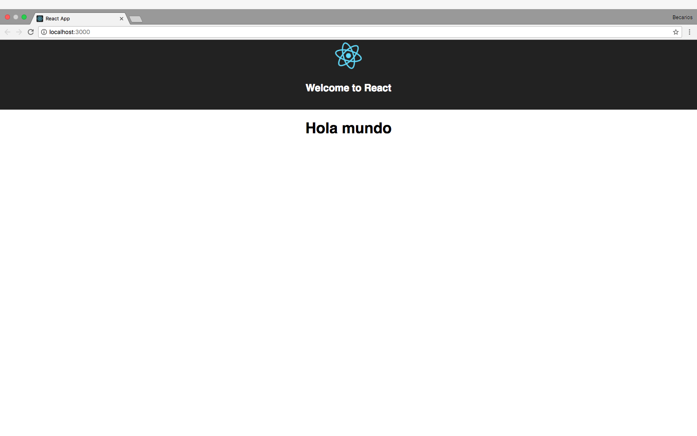

# React tutorial - Autentia

[React](https://facebook.github.io/react/) es una librería para crear interfaces de usuarios. Fue creada por Facebook en 2011 y liberada como open source en 2013, cuenta con proyectos en producción por compañías como Netflix, Airbnb, Walmart, Facebook e Instagram.

Sus más notables propuestas son:

* Propagación de datos unidireccional

    Los datos son propagados de __componentes padres a componentes hijos__. La comunicación entre padres e hijos se hace mediante __callbacks__ y los eventos son propagados de hijos a padres, siendo los componentes padre los que gestionan el estado y la lógica.

* DOM Virtual

    React genera una estructura en memoria semejante al DOM físico. Cuando detecta algún cambio compara entre el DOM virtual y el DOM físico y sólamente recarga aquello que haya cambiado y que sea visible para el usuario. Ésta innovación hace obsoleto el tener que recargar la página entera cada vez que el estado es modificado.

* JSX

    JSX es una extensión de la sintaxis de Javascript comúnmente usada para codificar los componentes. Es semejante a html y se embebe en los ficheros `.js`.

* Aplicaciones isomórficas

    Esto quiere decir que las aplicaciones web se pueden renderizar tanto en el cliente como en el servidor.

* React Native

    Facebook lanzó en 2015 [React Native](https://facebook.github.io/react-native/), el cual permite crear componentes usando herramientas de desarollo web y que genera aplicaciones __nativas__ tanto para _Android_ como para _IOS_.

## Instalación

Vamos a usar [Create React App](https://github.com/facebookincubator/create-react-app) para crear una aplicación web, sin necesidad de configurar nada.

Unicamente necesitaremos instalar en nuestra máquina [NodeJS](https://nodejs.org/en/) (Versión 7.7.4).

Una vez instalado NodeJS pasaremos a descargar la utilidad de `create-react-app`. Para ello abrimos terminal y seguimos estos comandos:

```
npm install -g create-react-app

create-react-app react-tutorial
cd react-tutorial/
npm start
```

`-g quiere decir que instalaremos globalmente create-react-app. Esto es necesario ya que create-react-app genera toda una aplicación y por ello se usa globalmente.`

Si todo ha ido bien veremos la siguiente pantalla:


¿Qué es lo que ha hecho create-react-app?

Create React App ha generado y dispuesto una estructura de ficheros de la siguiente forma:

```
react-tutorial/
  README.md
  node_modules/     // Librerías de nuestra aplicación
  package.json      // Información y dependencias de nuestro proyecto
  .gitignore        // Fichero donde se determina qué carpetas no deberán ser trackeadas con git
  public/
    favicon.ico
index.html          // Página donde se inyectarán los componentes de React
  src/              // Directorio de desarollo
    App.css
    App.js
    App.test.js
    index.css
    index.js
    logo.svg
```

## Componentes

Vamos a crear nuestro primer componente. Creamos un fichero nuevo llamado `Hola.js` en la carpeta `src`.

_Nota: Por convención los componentes de React se escriben con la primera letra en mayúsculas_.

```js
import React, { Component } from 'react';

class Hola extends Component {
  render() {
    return (
      <h1>Hola mundo</h1>
    );
  }
}

export default Hola;
```

Para usar este componente vamos a ir al fichero `App.js` y pondremos lo siguiente:

```js
import React, { Component } from 'react';
import logo from './logo.svg';
import './App.css';

// Importamos nuestro componente
import Hola from './Hola';

class App extends Component {
  render() {
    return (
      <div className="App">
        <div className="App-header">
          
          <h2>Welcome to React</h2>
        </div>
        <p className="App-intro">
          {/*Incluimos nuestro componente*/}
          <Hola/>
        </p>
      </div>
    );
  }
}

export default App;
```

Guardamos y veremos que la página se ha recargado automáticamente. Tendríamos que ver lo siguiente:



No olvidemos que podemos hacer que se rendericen componentes dinámicamente. Imaginemos que queremos hacer que
